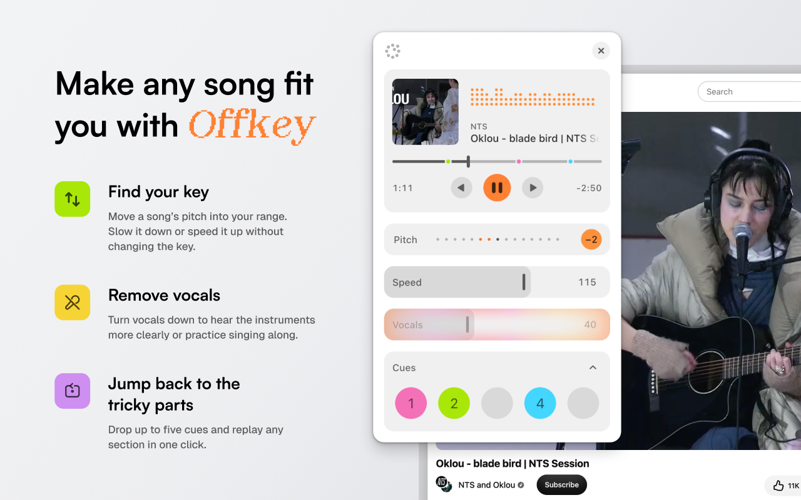

# Offkey

Offkey is a Chrome extension for singers and musicians. It puts a small player on top of YouTube and
YouTube Music, so you can change how a song sounds while it plays.

- **Pitch:** move a song up or down by up to 7 semitones, without changing its speed.
- **Speed:** play from 50% to 150%, without changing its key.
- **Vocals:** turn the singing down with AI vocal separation, to sing or play along.
- **Cues:** save up to five spots in a song and jump to them instantly, with a click or the number keys 1–5.

It remembers your settings for the last 50 songs you changed. Everything runs on your computer:
no audio is saved, exported or uploaded.

**Status:** on its way to the Chrome Web Store. A side project, designed and built with AI (Claude Code).

## Try it

Until Offkey is in the Chrome Web Store, you can install a test version by hand (in Chrome, or another
Chromium browser like Edge, Brave or Arc):

1. Download the latest `offkey-<version>.zip` from [Releases](https://github.com/DenizWVZ/offkey/releases/latest).
2. Unzip it somewhere it can stay, like your Documents folder (not Downloads, which tends to get cleaned up).
   You'll get a folder called `offkey`.
3. Open `chrome://extensions`, turn on **Developer mode** (top right), click **Load unpacked** and choose the `offkey` folder.
4. Pin Offkey from the puzzle-piece menu in the toolbar. Open a song on YouTube or YouTube Music and click the Offkey button.

Chrome may remind you that a Developer mode extension is installed; that's expected for a test version.

**Updating:** test versions don't update by themselves. Download the new zip, replace the contents of your
`offkey` folder with the new ones (same place), then click the reload arrow on Offkey's card in
`chrome://extensions`. Your settings and cues are kept.

## Build it yourself

Needs Node.js and Google Chrome.

- `npm install`, then `npm run build:ext` builds the extension into `dist-extension/`. Load it in
  `chrome://extensions` (Developer mode → Load unpacked), open a song on YouTube and click Offkey's toolbar button.
- `npm run dev` starts the playground at http://localhost:5173, for working on the widget with a song from your computer.
- `npm run build:demo` builds the demo page (the widget on a plain page, for any audio file) into `dist-demo/`.

The build downloads the vocal model (30 MB) from Ultimate Vocal Remover's official release the first time.

## How it's built

React and TypeScript (Vite). Pitch and speed run through Signalsmith Stretch; vocal separation runs the
UVR-MDX-NET model with ONNX Runtime Web, on the graphics chip where available. Design values live in
`src/widget/tokens.ts`. Working notes: `docs/plan.md` and `docs/history.md`.

## Credits and licence

Vocal separation uses UVR-MDX-NET 1 from [Ultimate Vocal Remover](https://github.com/Anjok07/ultimatevocalremovergui)
by Anjok07 and aufr33 (MIT). Full open-source credits: `src/extension/NOTICES.txt`.

Offkey's own code is MIT licensed (see `LICENSE`).
